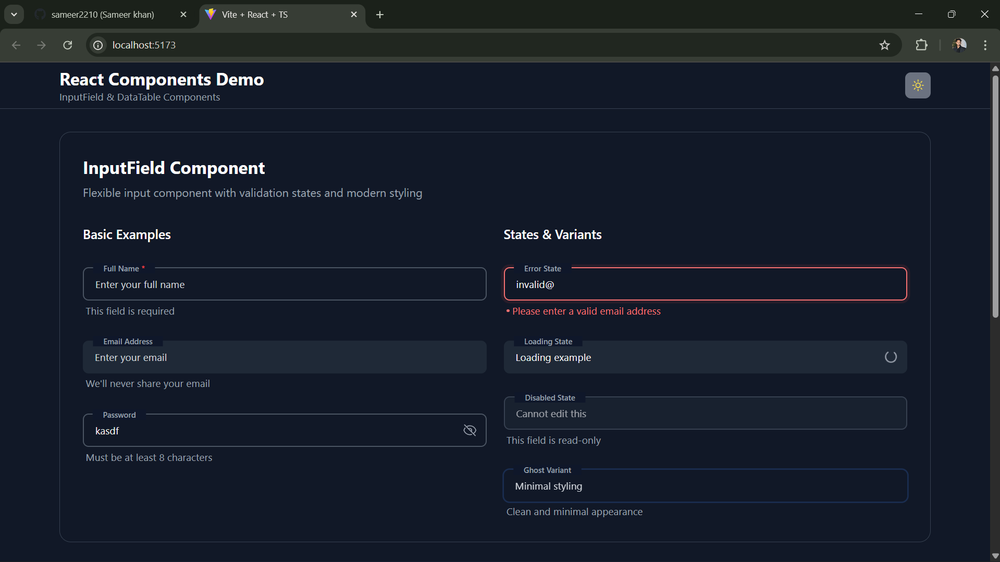
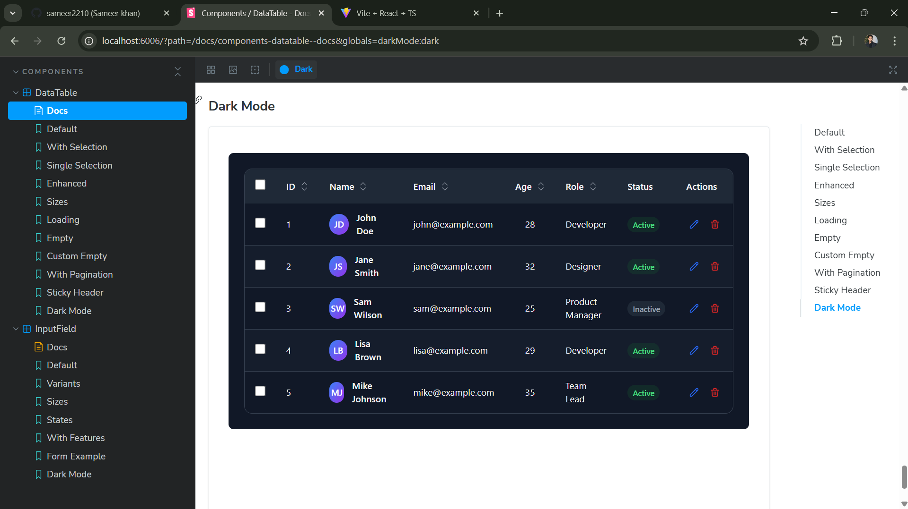

# React Components Library

> A modern, production-ready React component library featuring **InputField** and **DataTable** components built with TypeScript, TailwindCSS, and industry best practices.

## Live Demo & Storybook

[](https://react-components-tan-two.vercel.app)

[](https://68a2dfe4cb8afbff5930bb67-zswgcohqbu.chromatic.com/)

---

## 📸 Screenshots

### InputField Component



### DataTable Component



## Key Features

### **InputField Component**

- ** Multiple Variants**: Outlined, Filled, Ghost styles
- ** Flexible Sizing**: Small, Medium, Large configurations
- ** Advanced States**: Loading, Error, Disabled with smooth animations
- ** Enhanced UX**: Floating labels, clear button, password toggle
- ** Full Validation**: Error messages, helper text, required fields
- ** Accessibility**: ARIA labels, keyboard navigation, screen reader support
- ** Dark Mode**: Complete dark theme integration

### **DataTable Component**

- ** Interactive Sorting**: Click headers to sort ascending/descending
- ** Row Selection**: Single, multiple, or no selection modes
- ** Modern UI**: Hover effects, striped rows, clean borders
- ** Responsive Design**: Horizontal scroll, mobile-optimized
- ** Loading States**: Skeleton loading and empty state handling
- ** Custom Rendering**: Support for custom cell renderers and actions
- ** Pagination**: Built-in pagination with page size controls
- ** Sticky Headers**: Keep headers visible during scrolling
- ** Dark Mode**: Seamless dark theme support

[](https://reactjs.org/)
[](https://www.typescriptlang.org/)
[](https://tailwindcss.com/)
[](https://storybook.js.org/)
[](https://vitejs.dev/)

## 🛠️ Tech Stack

| Technology       | Version | Purpose                                           |
| ---------------- | ------- | ------------------------------------------------- |
| **React**        | 18.2+   | Modern React with hooks and functional components |
| **TypeScript**   | 5.8+    | Type safety and enhanced developer experience     |
| **TailwindCSS**  | 3.4+    | Utility-first styling framework                   |
| **Storybook**    | 7+      | Component documentation and testing               |
| **Vite**         | 5.4+    | Fast build tool and development server            |
| **Heroicons**    | 2.2+    | Beautiful SVG icons                               |
| **Lucide React** | 0.539+  | Additional icon library                           |

## Quick Start

### Installation

```bash
# Clone the repository
git clone https://github.com/yourusername/react-components-library.git
cd react-components-library

# Install dependencies
npm install

# Start development server
npm run dev

# Launch Storybook (Component Documentation)
npm run storybook
```

### Development Commands

```bash
# Development
npm run dev              # Start Vite dev server
npm run storybook       # Launch Storybook

# Production
npm run build           # Build for production
npm run build-storybook # Build Storybook

# Code Quality
npm run lint            # Run ESLint
npm run preview         # Preview production build


# Run Chromatic for Storybook
npm run chromatic       #Deploy Storybook

📌 This will give you a public Storybook link like:
👉 https://68a2dfe4cb8afbff5930bb67-zswgcohqbu.chromatic.com


```

## Usage Examples

### InputField Component

```tsx
import { InputField } from "./components/InputField";
import { useState } from "react";

function LoginForm() {
  const [formData, setFormData] = useState({
    email: "",
    password: "",
  });

  return (
    <form className="space-y-4">
      <InputField
        label="Email Address"
        placeholder="Enter your email"
        type="email"
        value={formData.email}
        onChange={(e) =>
          setFormData((prev) => ({
            ...prev,
            email: e.target.value,
          }))
        }
        variant="outlined"
        size="md"
        clearable
        required
        helperText="We'll never share your email"
      />

      <InputField
        label="Password"
        placeholder="Enter your password"
        type="password"
        value={formData.password}
        onChange={(e) =>
          setFormData((prev) => ({
            ...prev,
            password: e.target.value,
          }))
        }
        variant="outlined"
        size="md"
        togglePassword
        required
        helperText="Must be at least 8 characters"
      />
    </form>
  );
}
```

### DataTable Component

```tsx
import { DataTable } from "./components/DataTable";
import { useState } from "react";

interface User {
  id: number;
  name: string;
  email: string;
  role: string;
  status: "Active" | "Inactive";
}

function UserManagement() {
  const [selectedUsers, setSelectedUsers] = useState<User[]>([]);

  const users: User[] = [
    {
      id: 1,
      name: "John Doe",
      email: "john@example.com",
      role: "Developer",
      status: "Active",
    },
    // ... more users
  ];

  const columns = [
    {
      key: "id",
      title: "ID",
      dataIndex: "id" as keyof User,
      sortable: true,
      width: 80,
    },
    {
      key: "name",
      title: "Full Name",
      dataIndex: "name" as keyof User,
      sortable: true,
      render: (value: string) => (
        <div className="flex items-center gap-3">
          <div className="w-8 h-8 bg-blue-500 rounded-full flex items-center justify-center text-white text-sm font-semibold">
            {value
              .split(" ")
              .map((n) => n[0])
              .join("")}
          </div>
          <span className="font-medium">{value}</span>
        </div>
      ),
    },
    {
      key: "status",
      title: "Status",
      dataIndex: "status" as keyof User,
      render: (value: string) => (
        <span
          className={`px-3 py-1 rounded-full text-xs font-medium ${
            value === "Active"
              ? "bg-green-100 text-green-800"
              : "bg-gray-100 text-gray-800"
          }`}
        >
          {value}
        </span>
      ),
    },
  ];

  return (
    <DataTable
      data={users}
      columns={columns}
      selectable="multiple"
      onRowSelect={setSelectedUsers}
      hoverable
      striped
      pagination={{
        current: 1,
        pageSize: 10,
        total: users.length,
        onChange: (page, pageSize) => {
          console.log("Page changed:", page, pageSize);
        },
      }}
      onRowClick={(user) => {
        console.log("User clicked:", user.name);
      }}
    />
  );
}
```

## 📚 Component APIs

### InputField Props

| Property         | Type                                | Default      | Description                     |
| ---------------- | ----------------------------------- | ------------ | ------------------------------- |
| `value`          | `string`                            | `''`         | Input value                     |
| `onChange`       | `(e: ChangeEvent) => void`          | -            | Change event handler            |
| `label`          | `string`                            | -            | Floating label text             |
| `placeholder`    | `string`                            | -            | Placeholder text                |
| `variant`        | `'outlined' \| 'filled' \| 'ghost'` | `'outlined'` | Visual style variant            |
| `size`           | `'sm' \| 'md' \| 'lg'`              | `'md'`       | Component size                  |
| `type`           | `string`                            | `'text'`     | HTML input type                 |
| `disabled`       | `boolean`                           | `false`      | Disable the input               |
| `invalid`        | `boolean`                           | `false`      | Show error state                |
| `loading`        | `boolean`                           | `false`      | Show loading spinner            |
| `clearable`      | `boolean`                           | `false`      | Show clear button               |
| `togglePassword` | `boolean`                           | `false`      | Show password visibility toggle |
| `required`       | `boolean`                           | `false`      | Mark field as required          |
| `helperText`     | `string`                            | -            | Helper text below input         |
| `errorMessage`   | `string`                            | -            | Error message text              |

### DataTable Props

| Property      | Type                                 | Default | Description                |
| ------------- | ------------------------------------ | ------- | -------------------------- |
| `data`        | `T[]`                                | -       | Array of data objects      |
| `columns`     | `Column<T>[]`                        | -       | Column definitions         |
| `loading`     | `boolean`                            | `false` | Show loading state         |
| `selectable`  | `boolean \| 'single' \| 'multiple'`  | `false` | Row selection mode         |
| `onRowSelect` | `(rows: T[]) => void`                | -       | Selection change callback  |
| `size`        | `'sm' \| 'md' \| 'lg'`               | `'md'`  | Table size                 |
| `striped`     | `boolean`                            | `true`  | Alternate row colors       |
| `hoverable`   | `boolean`                            | `true`  | Row hover effects          |
| `bordered`    | `boolean`                            | `true`  | Show table borders         |
| `sticky`      | `boolean`                            | `false` | Sticky table header        |
| `maxHeight`   | `string \| number`                   | -       | Maximum table height       |
| `pagination`  | `PaginationConfig`                   | -       | Pagination configuration   |
| `onRowClick`  | `(record: T, index: number) => void` | -       | Row click handler          |
| `emptyText`   | `ReactNode`                          | -       | Custom empty state content |

## Design System

### Color Palette

- **Primary**: Blue (#3B82F6 - #2563EB)
- **Success**: Green (#10B981 - #059669)
- **Warning**: Amber (#F59E0B - #D97706)
- **Error**: Red (#EF4444 - #DC2626)
- **Neutral**: Gray (#F9FAFB - #111827)

### Typography Scale

- **Headings**: 600-700 font weight
- **Body**: 400-500 font weight
- **Small**: 0.875rem (14px)
- **Base**: 1rem (16px)
- **Large**: 1.125rem (18px)

### Spacing System

- **xs**: 0.5rem (8px)
- **sm**: 0.75rem (12px)
- **md**: 1rem (16px)
- **lg**: 1.5rem (24px)
- **xl**: 2rem (32px)

## 🌙 Dark Mode Support

Both components feature complete dark mode support. Toggle dark mode programmatically:

```tsx
// Toggle dark mode
const toggleDarkMode = () => {
  document.documentElement.classList.toggle("dark");
};

// Or set explicitly
document.documentElement.classList.add("dark"); // Enable
document.documentElement.classList.remove("dark"); // Disable
```

## Responsive Design

- **Mobile First**: Optimized for mobile devices
- **Breakpoints**: sm (640px), md (768px), lg (1024px), xl (1280px)
- **Touch Friendly**: Proper touch targets (44px minimum)
- **Adaptive**: Components adjust to container width

## Accessibility Features

- ✅ **Semantic HTML**: Proper HTML5 elements and structure
- ✅ **ARIA Labels**: Full screen reader support
- ✅ **Keyboard Navigation**: Tab, Enter, Space key support
- ✅ **Focus Management**: Clear focus indicators and trapping
- ✅ **Color Contrast**: WCAG AA compliant (4.5:1 ratio)
- ✅ **Screen Reader**: Tested with NVDA and VoiceOver

## 📖 Storybook Documentation

Access comprehensive component documentation and interactive playground:

```bash
npm run storybook
```

Visit `http://localhost:6006` to explore:

- Interactive component playground
- All variants, states, and configurations
- Usage examples and code snippets
- Props documentation with controls
- Dark mode toggle for testing
- Responsive viewport testing

**Deployment Options:**

- **Vercel**: Connect GitHub repository for auto-deployment
- **Netlify**: Drag & drop `storybook-static` folder
- **GitHub Pages**: Use GitHub Actions workflow
- **Chromatic**: `npx chromatic --project-token=<your-token>`

## 📁 Project Structure

```
react-components-library/
├── 📁 .storybook/          # Storybook configuration
│   ├── main.ts
│   └── preview.tsx
├── 📁 src/
│   ├── 📁 components/
│   │   ├── 📁 InputField/
│   │   │   ├── InputField.tsx
│   │   │   ├── InputField.types.ts
│   │   │   ├── InputField.stories.tsx
│   │   │   └── index.ts
│   │   └── 📁 DataTable/
│   │       ├── DataTable.tsx
│   │       ├── DataTable.types.ts
│   │       ├── DataTable.stories.tsx
│   │       └── index.ts
│   ├── App.tsx
│   ├── main.tsx
│   └── index.css
├── 📄 package.json
├── 📄 tsconfig.json
├── 📄 tailwind.config.js
├── 📄 vite.config.ts
└── 📄 README.md
```

### Testing Strategy

- **Unit Tests**: Component logic testing
- **Integration Tests**: Component interaction testing
- **Visual Tests**: Storybook visual regression testing
- **Accessibility Tests**: A11y compliance validation

## 🗺️ Roadmap

### Phase 1 - Enhanced Inputs ⏳

- [ ] DatePicker component
- [ ] Select/Dropdown component
- [ ] Textarea component
- [ ] File upload component

### Phase 2 - Advanced Features 🔮

- [ ] Virtual scrolling for large datasets
- [ ] Advanced filtering and search
- [ ] Drag & drop functionality
- [ ] Export functionality (CSV, PDF)

### Phase 3 - Developer Experience 🚀

- [ ] Theme customization system
- [ ] Component generator CLI
- [ ] Figma design tokens integration
- [ ] Performance optimization

## 🤝 Contributing

We welcome contributions! Please follow these steps:

1. **Fork** the repository
2. **Create** a feature branch: `git checkout -b feature/amazing-feature`
3. **Commit** your changes: `git commit -m 'Add amazing feature'`
4. **Push** to branch: `git push origin feature/amazing-feature`
5. **Submit** a Pull Request

### Development Setup

```bash
git clone https://github.com/yourusername/react-components-library.git
cd react-components-library
npm install
npm run dev
```

## 📄 License

This project is licensed under the **MIT License** - see the [LICENSE](LICENSE) file for details.

## 🙋‍♂️ Support

- 📧 **Email**: your.email@example.com
- 🐛 **Issues**: [GitHub Issues](https://github.com/yourusername/react-components-library/issues)
- 💬 **Discussions**: [GitHub Discussions](https://github.com/yourusername/react-components-library/discussions)

---

# folder Stracture

react_components/
│
├── node_modules/
│
├── src/
│ ├── components/
│ │ ├── InputField/
│ │ │ ├── InputField.tsx
│ │ │ ├── InputField.types.ts
│ │ │ ├── InputField.stories.tsx
│ │ │ └── index.ts
│ │ │
│ │ ├── DataTable/
│ │ │ ├── DataTable.tsx
│ │ │ ├── DataTable.types.ts
│ │ │ ├── DataTable.stories.tsx
│ │ │ └── index.ts
│ │
| |
│ ├── App.tsx
│ ├── main.tsx
│ ├── index.css
│ └── vite-env.d.ts
│
├── .storybook/
│ ├── main.ts
│ └── preview.ts
│
├── .gitignore
├── eslint.config.js
├── index.html
├── package.json
├── tsconfig.json
├── tsconfig.app.json
├── tsconfig.node.json
├── vite.config.ts
└── README.md

## 📋 Roadmap

- [ ] Add more input types (date, select, textarea)
- [ ] DataTable virtual scrolling for large datasets
- [ ] Form validation integration
- [ ] Animation presets
- [ ] Theme customization system
- [ ] Additional component variants

---

<div align="center">

**Star this repo if you find it helpful! **

Built with ❤️ by [ SAM ](https://github.com/sameer2210)

[](https://portfolio-coral-two-16.vercel.app)

</div>

**Happy coding!**
